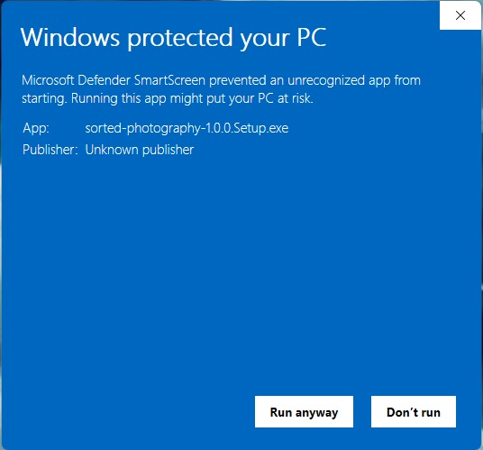
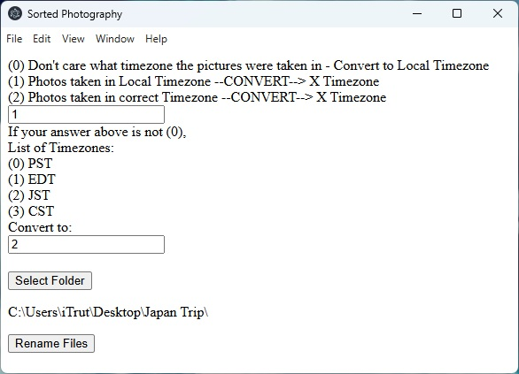

# Sorted Photography
After coming back from a trip with many dslr photos, I started backing them up on Google Drive. Soon later I realized I should be uploading photos and videos to Google Photos, not Google Drive, as Photos would show each image already rendered on the screen whereas Drive would require clicking each image to view in fullscreen. Migrating them over seemed to sometimes change the exif data, as images I was uploading to an album in Photos were placed out of order. I made this program to help rename and organize my assets, to be placed in Google Photos albums.


## Run as a desktop app (Windows and MacOS users)
[Releases](https://github.com/trumanjchan/sorted-photography/releases)

> Certificates to sign distributables are expensive yearly subscriptions. Since I did not buy any certificates to sign my windows and macos distributables, the easiest way to try out Sorted Photography would be on a Windows pc and downloading then running the exe file.

<details>

<summary>Windows Guide</summary>




</details>


### Tested file extensions
- JPG/JPEG
- PNG
- HEIC
- CR2
- MOV

### Options
- Don't care what timezone the pictures were taken in - Convert to Local Timezone
- Photos taken in Local Timezone --CONVERT--> X Timezone (ex: dslr was set to local timezone, and forgot to change when going on vacation)
- Photos taken in correct Timezone --CONVERT--> X Timezone (ex: phone or dslr auto-detects timezone)

### Run locally in VS Code
Requirements: VS Code, node v21.0.0
```
npm install
npm run start
```

### Run locally as a desktop app
Requirements: VS Code, node v21.0.0
```
npm install
npm run make
```
then run the file generated in the /out folder

### Findings
- Discord: photos downloaded from Discord have their exif data stripped for security.